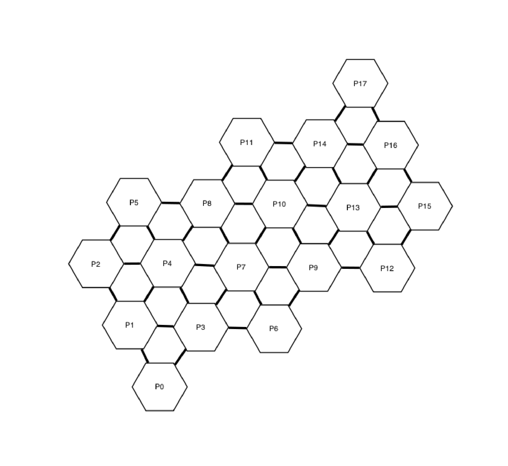

# GEM Suite

[](https://opensource.org/licenses/Apache-2.0)

The GEM (Generation of Entanglement by Measurement) protocol prepares a quantum state across many qubits using an efficient, measurement-based protocol.
Generally, it is technical challenge to achieve this on current generation quantum devices because most preparation protocols are vulnerable to imperfections in gates and to noise. The protocol that realizes the Nishimori transition, also understood as a fault-tolerant threshold, is a constant depth method that demonstrates how measurement-based state preparation might be used on large-scale quantum devices exceeding a few hundred qubits.
Through injecting coherent errors, the GEM experiment provides an estimate for how far below the error correction threshold a device is operating.

All technical details are available on arXiv: <https://arxiv.org/abs/2309.02863>

Because of the computationally intensive subroutine responsible for decoding the measurement outcomes, this library is mostly implemented in Rust programming language for performance. The core library is interfaced with [Qiskit Experiments](https://github.com/Qiskit-Extensions/qiskit-experiments) via [PyO3](https://docs.rs/pyo3/latest/pyo3/index.html) to produce experiment circuits with the Qiskit model and analyze the results. We support two minimum weight perfect matching decoders; [pymatching](https://github.com/oscarhiggott/PyMatching) and [fusion-blossom](https://github.com/yuewuo/fusion-blossom).

This library is designed to work with, but not limited only to, IBM Quantum processors.

## Installation

This package can be installed from the downloaded repository using pip as

```bash
cd gem-suite
pip install .
```

## Example

In the GEM protocol, an atomic unit of the experiment is a plaquette, which is a collection of multiple qubits.
For the case of IBM Quantum processors with heavy hexagonal lattices,
a single plaquette contains 12 qubits and a single IBM Eagle processor has 18 plaquettes.
This is an efficient compact representation of a quantum processor with a few hundred qubits. We anticipate very minor changes to this representation when scaling up to larger devices.



We can partly reproduce experiments in the publication with a few lines of code using the Qiskit Experiments framework.

```python
from gem_suite.experiments import GemExperiment
from qiskit_ibm_runtime import QiskitRuntimeService

backend = QiskitRuntimeService().backend("ibm_cusco")

gem_exp = GemExperiment(plaquettes=range(18), backend=backend)
exp_data = gem_exp.run().block_for_results()
```

Please see [our example notebook](./examples/01_gem_benchmark.ipynb) for the complete workflow.

## License

[Apache License 2.0](LICENSE.txt)
